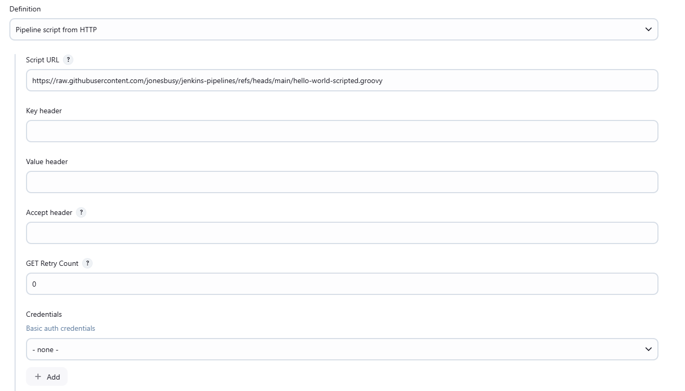

# HTTP Pipeline Plugin

The current official plugin [workflow-cps](https://github.com/jenkinsci/workflow-cps-plugin/) does provide a way to retrieve a Jenkinsfile through a SCM, such as Git. The goal of this plugin is to provide another way to retrieve Jenkinsfiles via HTTP calls.

This is a way to separate to concerns : source code (SCM) and built artifacts (binaries). Built artifacts are immutable, tagged and often stored on a different kind of infrastructure. Since pipelines can be used to make production loads, it makes sense to host the libraries on a server with a production-level SLA for example. You can also make sure that your artefact repository is close to your pipelines and share the same SLA. Having your Jenkins and your artefact repository close limitsr latency and limits network issues.

## Context

The HTTP Pipeline Plugin was implemented to retrieve Jenkinsfiles through HTTP (or HTTPs) instead of a SCM.

## How to use the plugin

1. Create a pipeline job
2. Select the `Pipeline script from HTTP` option in the `Pipeline` section

### Use with the GitHub API

URL: https://api.github.com/repos/[your_org]/[your_repo]/contents/[path_in_repo]?ref=master
Accept Header: application/vnd.github.VERSION.raw

## Contributing

You can contribute to this plugin by retrieving the source and following the [official Jenkins plugin tutorial](https://wiki.jenkins.io/display/JENKINS/Plugin+tutorial) to install, run, test and package it.

## Legal

This project is licensed under the terms of the [MIT license](LICENSE).
